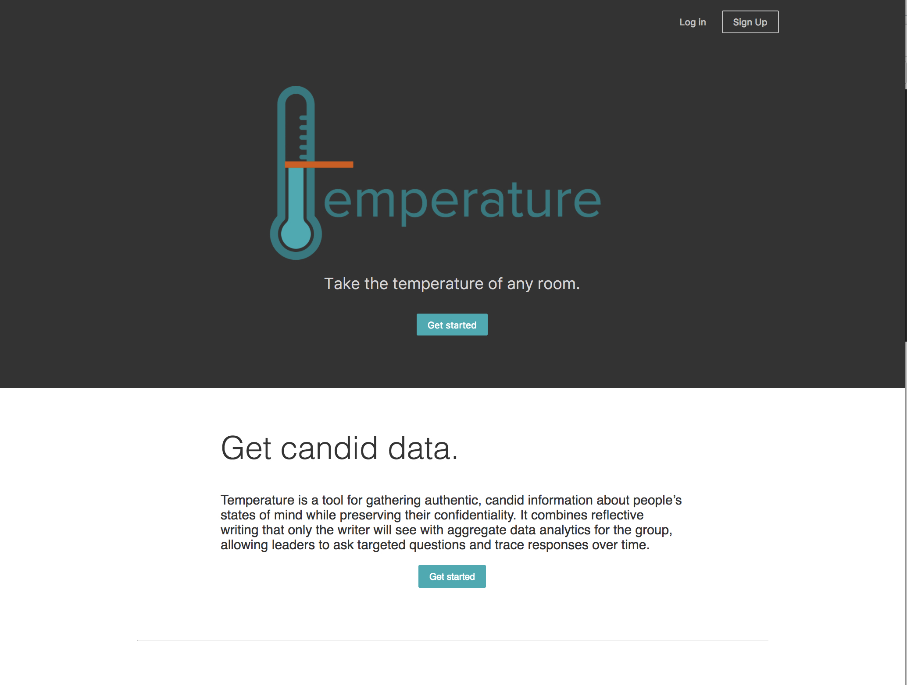

# 

Temperature is a React app that lets leaders take the temperature of their group and track it over time. Aimed at educators and leaders, it combines reflective writing that only the writer will see with aggregate data analytics to show leaders how the group is doing at any point in time.

The app lets leaders invite participants to a journal, assign reflections with targeted questions, and see D3 visualizations of sentiment analysis data generated by Google's Natural Language API. Reflection writers can confidentially express themselves on their own terms, revisit past reflections, and trace their personal progress using the same analytics feature.

Hosted on AWS: http://ec2-54-152-102-83.compute-1.amazonaws.com:8000/.

## Tech
* React
* Node.js
* JavaScript, HTML, CSS (with Tachyons)
* Express
* Knex.js
* PostgreSQL
* D3
* Google Natural Language API

## Next Steps
* Email integration with Mailgun
* Analytics broken out by individual for non-anonymous (but still private) journals
* Capability to break larger group into smaller teams
* Search feature for reflections
* Accessibility improvements
